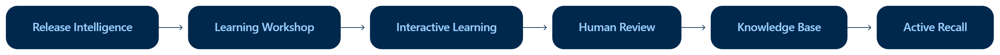

# Data Engineering Learning Resource

This repository supports a recurring release-intelligence and personalized learning pipeline for data engineering and related technical topics.

The pipeline monitors relevant changes in R, Python, Azure, APIs, databases, deployment, observability, AI systems, and adjacent areas. Important developments are translated into structured learning workshops and, after human review, into a cumulative knowledge base, with a focus on long-term retention and building strong technical intuition.

## Repository structure

- `reports/` — release-intelligence reports generated by the automated monitoring pipeline.
- `drafts/` — draft learning workshops derived from those reports.
- `workshop-progress/` — processing state for multi-session learning workshops.
- `learning/` — finalized, human-reviewed learning material organized by topic.
- `review-cards/` — concise active-recall material corresponding to the finalized learning topics.

## Process

The automated pipeline creates release reports and learning drafts. A separate interactive Learning Coach then works through the proposed material.

Only after a following human-in-the-loop learning process and explicit finalization is approved content added to `learning/` and `review-cards/`.

As a result, the permanent learning resources represent reviewed and personalized knowledge rather than automatically generated documentation.

  

